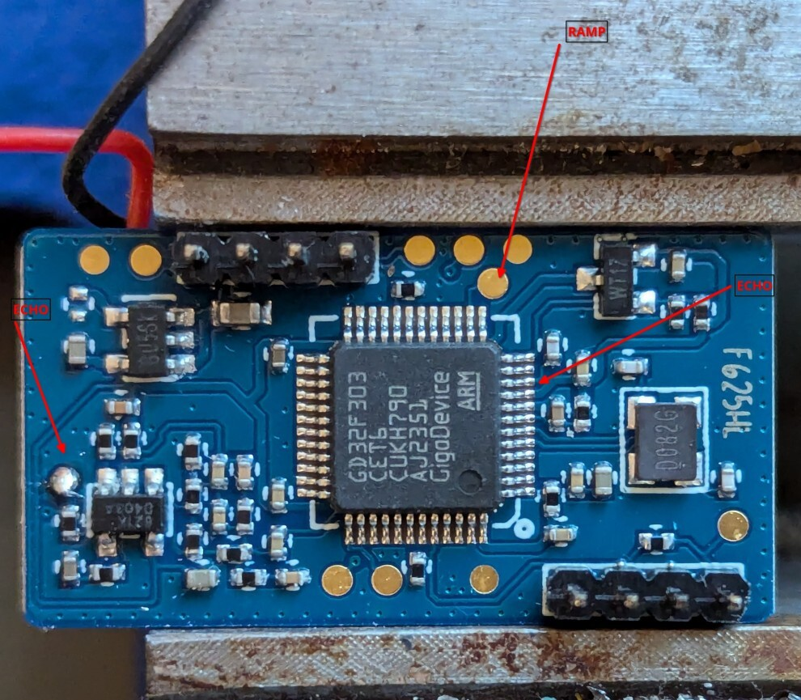

# What is the LD1125H?

The LD1125H is a FMCW 24GHz radar manufactured by the Chinese company Hi-Link.

It's main components consists of the 

- [SGRSemi SRK1101: Analog Radar 24GHz IC](http://sgrsemi.com/content/?1.html)
- [GigaDevice GD32F303CET6: Microcontroller clone of the STM32F303C](https://www.mouser.com/datasheet/2/870/GD32F303xx_Datasheet_Rev2_0-3134991.pdf)

The GD32 creates the VCO ramp and receives the down-mixed difference back into a ADC channel.

# PCB

# Signals

### VCO Ramp

#### Entire Sequence

#### Bursts

#### Bursts Detail

### Echo Signal

