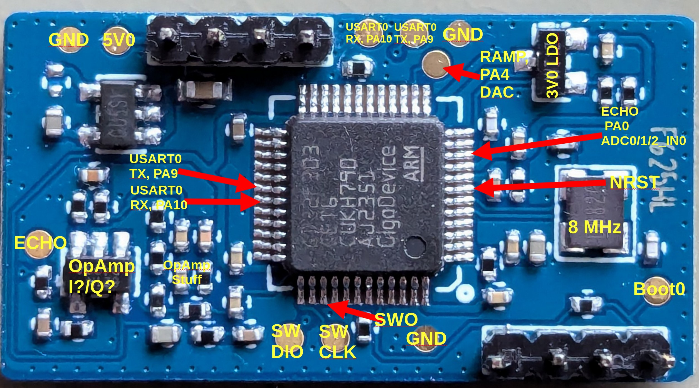
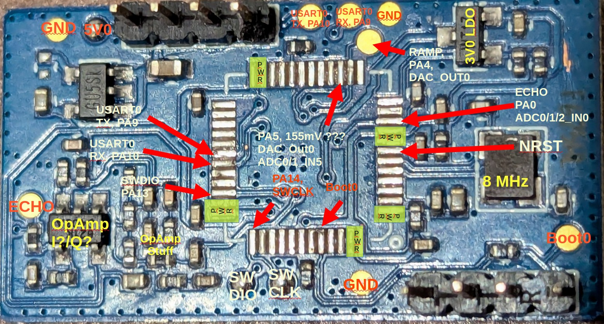

# What is the LD1125H?

The LD1125H is a FMCW 24GHz radar manufactured by the Chinese company Hi-Link.

It's main components consists of the 

- SGRSemi SGR1101: Analog Radar 24GHz IC for RX/TX and down-mixing
- [GigaDevice GD32F303CET6: CM4, 512k Flash, 64k RAM - not 100% compatible to its STM32 pendant](https://www.mouser.com/datasheet/2/870/GD32F303xx_Datasheet_Rev2_0-3134991.pdf)

The GD32 creates the VCO ramp using its DAC and receives the down-mixed echo signal back into a ADC channel.

For signal analysis the device does NOT offer full access to I/Q of the echo/bang signal as only one of both is connected to the ADC of the microcontroller.

# PCB



## Datasheets for the Radar IC

There aren't much datasheets around for the Radar IC. But it seems to be purely analog with some downmixing and VCO functionality.

These might be close to one we are looking for:

 - [SGRSemi SGR1101: Link I](http://www.szxlckj.com/mobile/products_detail.php?id=494&cid=88&search_key=&page=1)
 - [SGRSemi SGR1101: Link II](https://encrypted-tbn0.gstatic.com/images?q=tbn:ANd9GcSi1mKlVE2QAdNAQR0M2IrDAUOuMLKeAaDKWQ&s)

Also ham radio operator IK1ZYW played around with it [here](https://ik1zyw.blogspot.com/2023/09/enabling-prescaler-on-hlk-ld1115h-24.html). According to his research it's a clone of the  [Infineon BGT24LTR11N16](https://www.infineon.com/dgdl/Infineon-BGT24LTR11N16-DataSheet-v01_30-EN.pdf?fileId=5546d4625696ed7601569d2ae3a9158a). Very untypical for Infineon they are giving us a metry ton of very high quality datasheets and application notes on their [product website](https://www.infineon.com/cms/en/product/sensor/radar-sensors/radar-sensors-for-iot/24ghz-radar/bgt24ltr11n16/) without having us seeling our soul to a NDA.


## Signals

### VCO Ramp

#### Entire Sequence


The entire sequence jitters heavily.

#### Bursts


#### Bursts Detail


### Beat (Echo) + Ramp Signal


## Firmware


With a ST-Link adapter OpenOCD and    [this](https://github.com/gd32-rs/gd32-openocd/blob/master/target/gd32f30x.cfg) configuration file the device can be accessed.

### Connecting to the chip using OpenOCD

```
# openocd -f interface/stlink.cfg  -f  ~/gd32f30x.cfg -c "init; reset halt"

openocd -f interface/stlink.cfg -f ~/Downloads/gd32f30x.cfg 
Open On-Chip Debugger 0.12.0
Licensed under GNU GPL v2
For bug reports, read
        http://openocd.org/doc/doxygen/bugs.html
Info : auto-selecting first available session transport "hla_swd". To override use 'transport select <transport>'.
Info : The selected transport took over low-level target control. The results might differ compared to plain JTAG/SWD
Info : DEPRECATED target event trace-config; use TPIU events {pre,post}-{enable,disable}
Info : Listening on port 6666 for tcl connections
Info : Listening on port 4444 for telnet connections
Info : clock speed 1000 kHz
Info : STLINK V2J23S0 (API v2) VID:PID 0483:3748
Info : Target voltage: 2.936993
Info : [gd32f3x.cpu] Cortex-M4 r0p1 processor detected
Info : [gd32f3x.cpu] target has 6 breakpoints, 4 watchpoints
Info : starting gdb server for gd32f3x.cpu on 3333
Info : Listening on port 3333 for gdb connections
Info : accepting 'telnet' connection on tcp/4444
```

Jackpot!


```
> flash info 0
#0 : stm32f1x at 0x08000000, size 0x00080000, buswidth 0, chipwidth 0
        #  0: 0x00000000 (0x1000 4kB) not protected
        #  1: 0x00001000 (0x1000 4kB) not protected
        #  2: 0x00002000 (0x1000 4kB) not protected
        #  3: 0x00003000 (0x1000 4kB) not protected
        #  4: 0x00004000 (0x1000 4kB) not protected
        #  5: 0x00005000 (0x1000 4kB) not protected
        #  6: 0x00006000 (0x1000 4kB) not protected
        #  7: 0x00007000 (0x1000 4kB) not protected
        #  8: 0x00008000 (0x1000 4kB) not protected
        #  9: 0x00009000 (0x1000 4kB) not protected
        # 10: 0x0000a000 (0x1000 4kB) not protected
        # 11: 0x0000b000 (0x1000 4kB) not protected
        # 12: 0x0000c000 (0x1000 4kB) not protected
        # 13: 0x0000d000 (0x1000 4kB) not protected
        # 14: 0x0000e000 (0x1000 4kB) not protected
        # 15: 0x0000f000 (0x1000 4kB) not protected
        # 16: 0x00010000 (0x1000 4kB) not protected
        # 17: 0x00011000 (0x1000 4kB) not protected
        # 18: 0x00012000 (0x1000 4kB) not protected
        # 19: 0x00013000 (0x1000 4kB) not protected
        # 20: 0x00014000 (0x1000 4kB) not protected
        # 21: 0x00015000 (0x1000 4kB) not protected
        # 22: 0x00016000 (0x1000 4kB) not protected
        # 23: 0x00017000 (0x1000 4kB) not protected
        # 24: 0x00018000 (0x1000 4kB) not protected
        # 25: 0x00019000 (0x1000 4kB) not protected
        # 26: 0x0001a000 (0x1000 4kB) not protected
        # 27: 0x0001b000 (0x1000 4kB) not protected
        # 28: 0x0001c000 (0x1000 4kB) not protected
        # 29: 0x0001d000 (0x1000 4kB) not protected
        # 30: 0x0001e000 (0x1000 4kB) not protected
        # 31: 0x0001f000 (0x61000 388kB) not protected
STM32F10x (High Density) - Rev: unknown (0x2104)
 ```

Nothing Is protected. Jackpot!

### Dumping the Flash

```
> flash read_bank 0 /home/had/ld1125h_dump.bin
wrote 524288 bytes to file /home/had/ld1125h_dump.bin from flash bank 0 at offset 0x00000000 in 7.822686s (65.451 KiB/
```
```
# sha256sum ld1125h_dump.bin 
52a8a3401e2062a228d57d75a1d877d73e81beae9e8473564e7dbb5e94d9f138  ld1125h_dump.bin
```

### Rough analysis of the dump

```
# strings ld1125h_dump.bin
(sorted out the interesting bits)

mov, dis=%.2f
mov, dis=%.2f, str=%.2f
occ, dis=%.2f
occ, dis=%.2f, str=%.2f
>v is %.2f km/h, mag is %.2f
erase failed
mov, dis=%.2f
mov, dis=%.2f, str=%.2f
occ, dis=%.2f
occ, dis=%.2f, str=%.2f
333@
!XHP0
occ raw data is ********************
%.2f %.2f
occ spectrum is ********************
%.2f
mov raw data is ********************
%.2f %.2f
mov spectrum is ********************
all vars have been initialized and saved
UID(hex) is:%08X-%08X-%08X
rmax=
rmax is %.2f
rcoef=
rcoef is %.4f
mth1_mov=
mth1_mov is %d
mth2_mov=
mth2_mov is %d
mth3_mov=
mth3_mov is %d
mth1_movs=
mth1_movs is %d
mth2_movs=
mth2_movs is %d
mth3_movs=
mth3_movs is %d
mth1_occ=
mth1_occ is %d
mth2_occ=
mth2_occ is %d
mth3_occ=
mth3_occ is %d
eff_th=
Beff_th is %d
accu_num=
accu_num is %d
test_mode=
test_mode is %d
output_mode=
output_mode is %d
ts_on=
ts_on is %d
ts_mov=
ts_mov is %d
ts_occ=
ts_occ is %d
ts_off=
ts_off is %d
pt_10ms=
 pt_10ms is %d
save
all vars have been saved
RKB1125H BW1800M 20230412 V4.1
get_all
sgr_get_all
initial
all vars have been initialized
data_obt=
data_obt is %d
vt is %d
get_uid
```

### Feeding it into Ghdira

A fitting SVD for the SVD-Import plugin can be found the [gd32-rust website](https://gd32-rust.github.io/gd32-rs/gd32f303.svd.patched). After setting the base address to 0x08000000 and the CPU type to CORTEX it worked out of the box.

Following memory map seems to work


Voila. Almost clean assembler code. Even the Decompiler seems to do its job more (or less).


