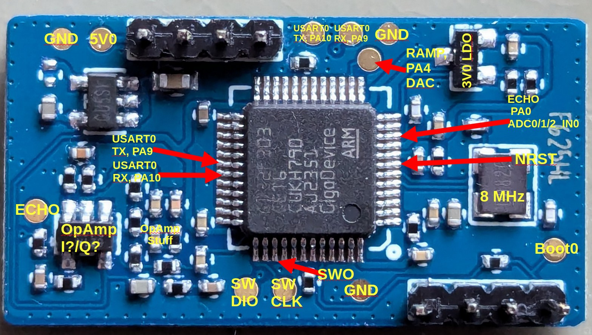

# What is the LD1125H?

The LD1125H is a FMCW 24GHz radar manufactured by the Chinese company Hi-Link.

It's main components consists of the 

- SGRSemi SGR1101: Analog Radar 24GHz IC for RX/TX and down-mixing
- [GigaDevice GD32F303CET6: Weird STM32F103 but as a Cortex M4 hybrid](https://www.mouser.com/datasheet/2/870/GD32F303xx_Datasheet_Rev2_0-3134991.pdf)

The GD32 creates the VCO ramp using its DAC and receives the down-mixed echo signal back into a ADC channel.

# PCB

## Datasheets for the Radar IC

There aren't much datasheets around for the Radar IC. But it seems to be purely analog with some downmixing and VCO functionality.

These might be close to one we are looking for:

 - [SGRSemi SGR1101: Link I](http://www.szxlckj.com/mobile/products_detail.php?id=494&cid=88&search_key=&page=1)
 - [SGRSemi SGR1101: Link I](https://encrypted-tbn0.gstatic.com/images?q=tbn:ANd9GcSi1mKlVE2QAdNAQR0M2IrDAUOuMLKeAaDKWQ&s)

Also ham radio operator IK1ZYW played around with it [here](https://ik1zyw.blogspot.com/2023/09/enabling-prescaler-on-hlk-ld1115h-24.html). According to his research it's a clone of the Infineon [BGT24LTR11N16](https://www.infineon.com/dgdl/Infineon-BGT24LTR11N16-DataSheet-v01_30-EN.pdf?fileId=5546d4625696ed7601569d2ae3a9158a) but with temperature compensation and less TX power.

We have the entire pin configuration and maybe the entire HF specification if it's clone of the Infineon.

## Signals

### VCO Ramp

#### Entire Sequence

#### Bursts

#### Bursts Detail

### Echo + Ramp Signal

